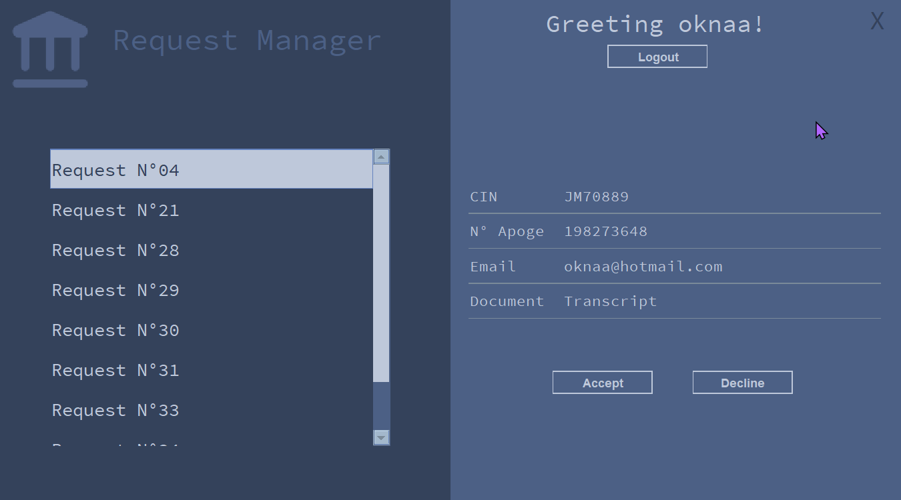

# GLProject
This is a program meant for the schools staff to help them manage the requests for administrative documents coming from the students. 
 
### Program description:
At the start, the user has to decide whether to use the program as a Student or as an Admin.

.png)

#### Student Space: 
The student can fill a form using this program, with his ID, Email, and the wanted document.
.png)

#### Admin Space:
the school staff can login as an admin;
.png)
or create an admin account.
.png)

And then navigate the list of requests.

they can either accept or decline a request :
 
By accepting a request, they send the requested document to the email address submitted in said request 
 
By declining a request, they send the massage stating the reason to the email address submitted in said request
